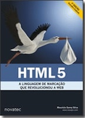
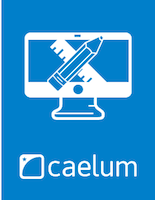

# LM

A disciplina de Linguagem de Marcação do Curso Superior de Tecnologia em Sistemas para Internet do IFPB tem como objetivo apresentar ao aluno conceitos sobre desenvolvimento Web Front-end. Sua carga horária apresenta um total de 50 horas aula e será ministrada pelo professor Luiz Carlos Chaves e Petrônio Medeiros. Para as aulas serão utilizadas exposições e atividades práticas, além de avaliações individuais e em grupo.

## Conteúdo

Dentre os principais temas que serão abordados na disciplina pode-se listar:

* Estrutura da Web
  * Função do cliente e servidor HTTP
  * Componentes para construir um sistema Web
* HTML
  * Hypertexto
  * Tag, atributo, Entidades
  * Estrutura do HTML
* CSS
  * Folha de estilo
  * Herança e cascata
  * Seletores, propriedades, funções, media query, at-rules
  * Definiação de layouts e estilos
  * Animações
  * Extenções de CSS
* XML
  * Definição
  * Estrutura
  * Validação

Além disso, é possível visualizar os detalhes do [roteiro das aulas](docs/OUTLINE.md), das [ferramentas utilizadas](docs/TOOLS.md) e de alguns [links úteis](docs/RESOURCES.md).

## Avaliações

A nota final será computado através da média ponderada das avaliações e poderá ser adicionada atividades extras.

### Provas Prática
* Avaliação I: HTML & CSS;
* Avaliação II: HTML & CSS;

### Trabalho
* Projeto: [A especificação do projeto](assessment/projeto.md).
* Blog: [A especificação do blog](assessment/blog.md).

## Comunicação
Toda a comunicação será realizada usando o 

## Bibliografia

### Bibliografia Básica

  

### Bibliografia Complementar

 

E para completar ainda mais a listagem existe estes [exemplares](https://github.com/vhf/free-programming-books/blob/master/free-programming-books.md#ruby-on-rails) como outros indicações.
